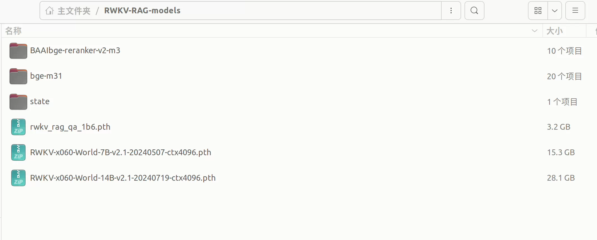
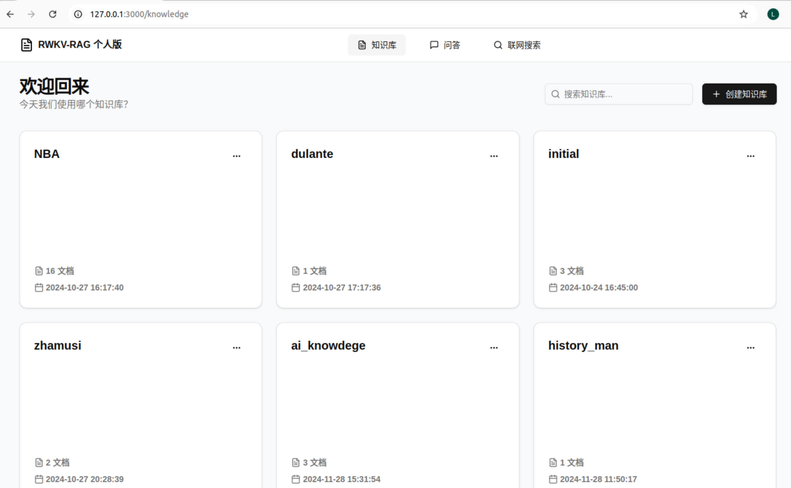
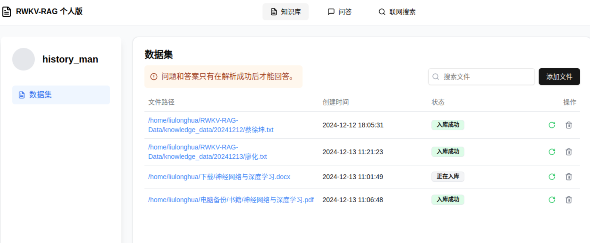
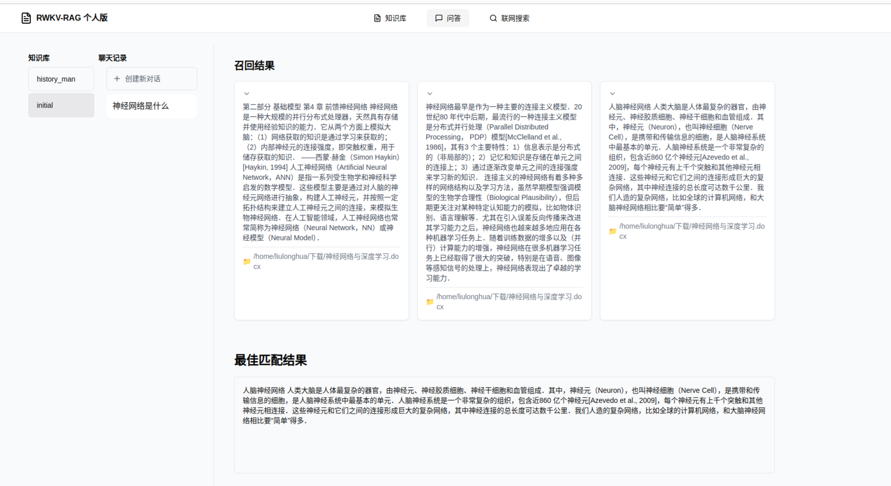

# RWKV-RAG-Personal  

RWKV-RAG-Personal 是RWKV-RAG 个人版，它是一个基于 RWKV 模型的一键 RAG 部署系统，可轻松搭建和管理本地知识库，同时提供了基于本地知识库的问答机器人（RWKV-RAG-CHAT）。


## 特性

- **💻 带图形化界面：** RWKV-RAG-Personal 的主要功能都有提供直观且易于操作的用户体验
- **⛓️ 配置简单：** RWKV-RAG-Personal 配置简单，没有太多的配置参数
- **🔐 数据安全：** 所有的模型服务和向量数据库服务都使用本地化部署，因此不会涉及任何数据上传，保证数据安全
- **🍔 支持多种文档：** 支持Excel、文本、word、PDF(图片格式的PDF文件暂不支持)、html、markdown等。
- **🎛️ 兼容性:** RWKV-RAG-Personal 兼容Linux和Windows系统


## 模型下载

完整的 RWKV-RAG-Personal 服务需要以下模型文件，请将以下模型下载到工作区：

- 下载 RWKV base model（基底模型）：[HuggingFace下载地址](https://huggingface.co/SupYumm/rwkv6_rag_qabot/tree/main)
- 下载 BGEM3 重排序模型（rerank model）：[HuggingFace下载地址](https://huggingface.co/BAAI/bge-reranker-v2-m3)  [modelscope下载地址](https://modelscope.cn/models/BAAI/bge-reranker-v2-m3)
- 下载 BGEM3 Embedding 模型: [HuggingFace下载地址](https://huggingface.co/BAAI/bge-m3)   [modelscope下载地址](https://modelscope.cn/models/BAAI/bge-m3)

> [!TIP]  
> 
> 建议模型文件放在同一个文件夹，便于管理，如下图示例所示。
> 
> 
>
> 请确认设备 VRAM 并选择一个合适的 RWKV 模型作为 RWKV-RAG-Personal 系统。以下是各参数 RWKV 模型的**推理 VRAM 需求**:
> 
> | SIZE        | VRAM |
> -------------|-----
> | RWKV-6-1B6  | 4G   |
> | RWKV-6-3B   | 7.5G |
> | RWKV-6-7B   | 18G |
> | RWKV-6-12B  | 24G|
> |  RWKV-6-14B |30G|
> 


目前 BGEM3 更适合作为 RWKV-RAG-Personal 系统的 rerank 和 embedding 模型。我们也在开发性能更强的 RWKV embedding 和 rerank 模型，以替换掉 BGEM3 模型。

## 下载和安装

> [!TIP]
> 
> 开始下载安装之前，确保系统已经安装Python3.10、NVIDIA驱动、CUDA12.1+


### 1. 克隆 RWKV-RAG-Personal 仓库

```
git clone https://github.com/AIIRWKV/RWKV-RAG-Personal.git
```

### 2. 安装依赖项
   
[创建python虚拟环境](https://blog.csdn.net/ARPOSPF/article/details/113616988)，进入到项目目录，安装Python依赖

##### Linux

```shell
pip3 install -r requirements.txt 
```

> [!WARNING]
> 
> Linux 系统安装torch==2.2.2时，默认安装GPU版，如果在该Python环境下执行torch.cuda.is_available()返回的False，说明安装的是CPU版本，这时建议单独安装torch
> ```shell
> pip3 install torch==2.2.2  --index-url https://download.pytorch.org/whl/cu121
>```


##### Windows

```shell
pip3.exe install -r requirements.txt
```

> [!WARNING]
> 
> Windows 系统安装torch==2.2.2时，默认安装CPU版，如果在该Python环境下执行torch.cuda.is_available()返回的False，说明安装的是CPU版本，这时建议单独安装torch
> ```shell
> pip3.exe install torch==2.2.2  --index-url https://download.pytorch.org/whl/cu121
>```
> 


### 3. 修改配置文件

可以通过修改项目配置文件 `ragq.yml` 修改配置参数，配置参数含义如下：

##### 模型相关参数
- **base_model_path**: RWKV 基底模型的路径，请参考 [RWKV 模型下载](https://rwkv.cn/RWKV-Fine-Tuning/Introduction#%E4%B8%8B%E8%BD%BD%E5%9F%BA%E5%BA%95-rwkv-%E6%A8%A1%E5%9E%8B) 
- **embedding_path**: 嵌入模型的路径，推荐使用: bge-m31
- **reranker_path**: 重排序模型的路径，推荐使用: BAAIbge-reranker-v2-m3

##### 数据库相关参数

- **vectordb_name**: 向量数据库名词，目前已集成如下向量数据库：
  - **Linux**：chromadb,milvus Lite版
  - **Windows**: chromadb
  
  > [!WARNING]
  > 
  > 默认使用的是chromadb，如果要使用其它向量数据库请先安装相关Python包
  > 
- **vectordb_path**: 向量数据库存放数据路径，确保路径是存在的
- **vectordb_port**: 向量数据库服务端口
- **vectordb_host**: 向量数据库服务地址，该项目运行时在本地会启动向量数据库服务，所以可填```localhost```、```127.0.0.1```,默认值```localhost```

##### 其它参数
- **knowledge_base_path**: 知识库路径，用于存放知识库文件。
- **strategy**: 混合精度，默认是空，对应的精度是cuda fp16，没有特殊场景需求，不需要修改该值。


### 4. 启动服务

启动服务之前请确保激活上面创建的python虚拟环境,打开Linux终端(Windows系统推荐使用PowerShell)，启动命令如下：
```shell
Windows的PowerShell
```


服务启动成功后会自动打开浏览器，应当可以看到如下界面：



至此， RWKV-RAG-Personal 服务已成功启动，可以在 WebUI 客户端中体验知识库管理、问答机器人等功能。


## RWKV-RAG-Personal 功能指引

### 知识库

知识库管理界面用于管理存储在向量数据库中的知识库，一个collection就是一个知识库，服务启动时默认都会创建一个名为initial的知识库。支持对知识库进行新增、删除和查询知识库内容等操作。


#### 知识入库

点击某个知识库就可以进入知识库的知识管理页面，如下图，这里包含一些知识管理操作，比如入库。目前支持两种不同的入库方式

- **手动输入：** 在输入框中手动输入或粘贴文本内容，系统会按行对文本进行Chunking（**分块**）
- **本地文件：** 如果你需要将电脑本地**某个文件**内容加入知识库，填写文件路径，系统会按照固定长度(暂定256,后续会做成可配置)和终止符(```'\n','!','?',';','。','；','！','？'```)结合的策略对文件进行Chunking（**分块**）
    


同时支持删除文件，在删除文件时，会删除文件的在数据库（包括向量数据库）中所有的数据；支持文件重新入库。

> [!TIP]  
> 
> RWKV-RAG-Personal 支持从互联网上搜索知识，并将搜索到的知识文本以 TXT 格式保存到**电脑本地的指定目录**。
>
> **联网搜索得到的 txt 文本文件仍然需要进行知识入库，才能加入现有知识库中。**


---

### 知识问答机器人

RWKV-RAG-Personal 系统提供基于知识库的问答机器人（RWKV-RAG-CHAT）。用户可以从现有的知识库中检索特定主题的知识，然后利用提取到的知识与模型进行聊天，以增强模型的回答效果。

RWKV-RAG-CHAT 的工作流程如下：

1. **点击“问答”按钮，选择“知识库”，创建新的对话**

2. **系统会从知识库中提取最相关的知识（文本块）及知识的来源**

3. **rerank 模型对提取出来的文本块进行匹配度打分，选出最佳匹配知识**

4. **在底部输入框中输入问题并点击 “发送” 按钮，与模型聊天**



## 喜欢 RWKV-RAG?🥰 
如果你喜欢 RWKV-RAG 不妨给我们一个 [⭐ Star](https://github.com/AIIRWKV/RWKV-RAG-Personal) 或者 [👀 Watch](https://github.com/AIIRWKV/RWKV-RAG-Personal/subscription) 我们的项目，从而能马上获得最新的更新！
你们的每一个鼓励和反馈都能支持我们走得更远。

除了通过以上方式支持我们外，也欢迎各位与我们一起共建 RWKV-RAG。

你可以在阅读教程的时候：
1. 遇到错别字、句子不通顺，欢迎通过 [RWKV官方论坛](https://community.rwkv.cn/c/12-category/12/) 或者 Github [Issue](https://github.com/AIIRWKV/RWKV-RAG-Personal/issues/new) 给我们反馈，我们会对其进行修改。
2. 如果你在读教程的过程中，遇到一些不懂的地方，需要求助，可以在我们的 [RWKV官方论坛](https://community.rwkv.cn/c/12-category/12/)提问，亦或者在 Github 上提交求助 [Issue](https://github.com/AIIRWKV/RWKV-RAG-Personal/issues/new) ，我们会尽力帮助你解决问题。

## 未来计划

- 以 ASR 和视觉为主的多模态框架将很快上线。此外，GraphRAG 和提示优化也在开发中。
- 集成全新的一键微调功能。

## Acknowledgement
- 所有 RWKV 模型来自 [@BlinkDL](https://github.com/BlinkDL) 的 [RWKV-LM ](https://github.com/BlinkDL/RWKV-LM)项目